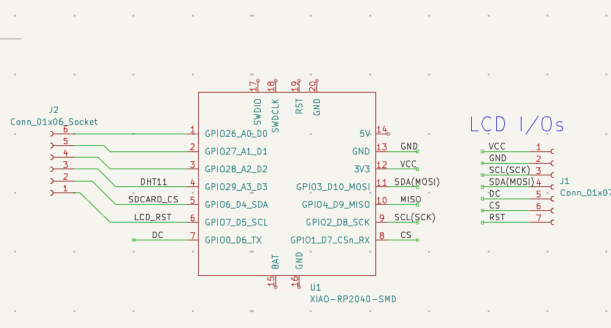

# GC9A01-XIAO-RP2040-Cpp

Projet C++ pour écran GC9A01 sur Raspberry Pi Pico / XIAO RP2040.

**Description**
- Exemple d'application qui pilote un écran TFT GC9A01 et utilise le SDK Pico.

**Prérequis**
- Raspberry Pi Pico / XIAO RP2040
- Pico SDK et toolchain installés (voir vos outils locaux)
- VS Code (optionnel) avec les tasks fournis

**Build (rapide)**
Depuis la racine du dépôt :

```powershell
# Configurez puis compilez
cmake -S . -B build
cmake --build build

# Ou utiliser la task VS Code "Compile Project"
``` 

Après compilation, l'artefact principal est généré dans `build/` (ex. `main.uf2`, `main.dis`).

**Flash / Déploiement**
- Copiez `build/main.uf2` sur la Pico en mode UF2 (double-cliquer BOOTSEL et monter le stockage USB), ou
- Utilisez la task VS Code "Run Project" ou la task `Flash` (OpenOCD/picotool) fournie dans les tasks de l'espace de travail.

**Fichiers importants**
- `main.cpp` — point d'entrée
- `TFT.cpp` / `TFT.h` — pilote d'écran
- `SDCard.cpp` / `SDCard.h` — gestion carte SD
- `CMakeLists.txt` — configuration de build

**Tests rapides**
- Pour vérifier la compilation locale : exécuter la task `Compile Project` dans VS Code ou lancer les commandes `cmake` ci-dessus.

**Wiring**



Figure : Câblage entre l'écran GC9A01 et la carte Pico / XIAO RP2040.

exemple fonts size 32 for LCD = http://guillaume.sahuc.free.fr/fonts/
